# Robotics Portfolio: Fazal E Haq

**Robotics Design & Control Systems Engineer** · Islamabad, Pakistan

Mechanical design and robot modelling in **SolidWorks**, with **URDF / ROS** exports, simulation and built hardware. The projects below span serial arms from 3 to 7 DOF, adaptive grippers, heavy two-axis mounts and an automation cell.

> **Full project files are private.** Native SolidWorks and STEP models, URDF packages, 2D drawings, BOMs and full-length videos for every project are kept in a private repository. **Access is available upon request** (see [Request access](#request-access)).

**Skills shown:** SolidWorks part/assembly design · design for 3D printing and machining · URDF export and ROS packages (RViz, Gazebo) · mass properties and joint torque sizing · SolidWorks Simulation (FEA) · 2D manufacturing drawings · BOMs and fastener schedules · assembly animations · hardware prototyping and trajectory control

## Highlights

<table>
<tr>
<td width="50%" align="center">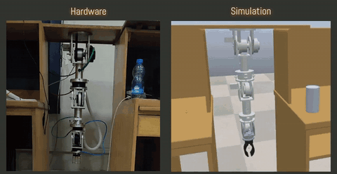 7-DOF arm: hardware and simulation running side by side</td>
<td width="50%" align="center">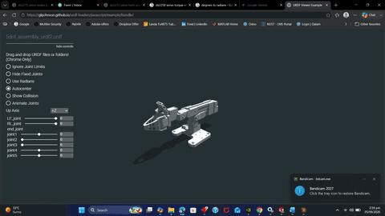 5-DOF extrusion-link arm: URDF joint test</td>
</tr>
<tr>
<td align="center">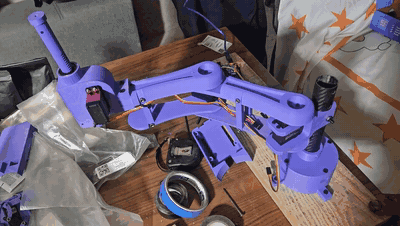 3-DOF SCARA: printed and assembled prototype</td>
<td align="center">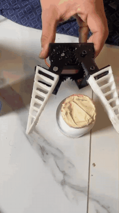 Fin Ray gripper conforming to objects</td>
</tr>
</table>

## Projects

<table>
<tr>
<td width="33%" align="center" valign="top">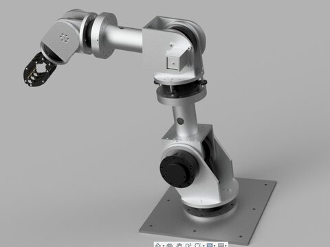 <b>7-DOF Modular Manipulator (MS Thesis)</b> 20.8 kg aluminium prototype designed, built and commissioned; simulation twin; computed torque control; 0.099 mm mean tracking error on a circular path</td>
<td width="33%" align="center" valign="top">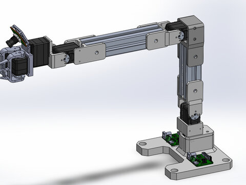 <b>5-DOF Extrusion-Link Arm (Modified SO-ARM)</b> 30 × 30 mm aluminium extrusion links, FEETECH STS3250 / STS3215 bus servos, 400 g payload target, URDF/ROS package</td>
<td width="33%" align="center" valign="top">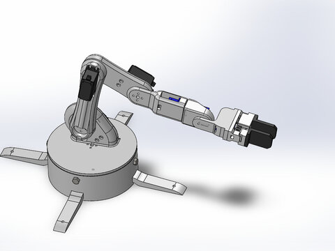 <b>6-DOF Low-Cost Servo Arm</b> MG996R / SG90 servos, rack-and-pinion gripper, 422.9 mm reach, joint torque budget from mass properties, URDF</td>
</tr>
<tr>
<td align="center" valign="top">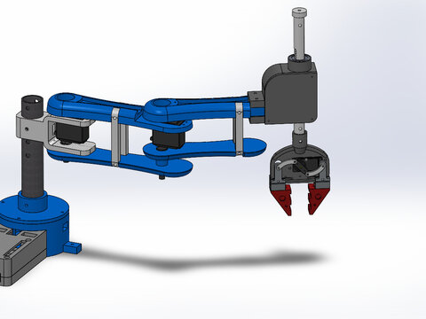 <b>3-DOF SCARA Manipulator</b> 3D-printed SCARA with rack-and-pinion Z axis; FEA-checked brackets; fabricated and assembled with no redesign</td>
<td align="center" valign="top">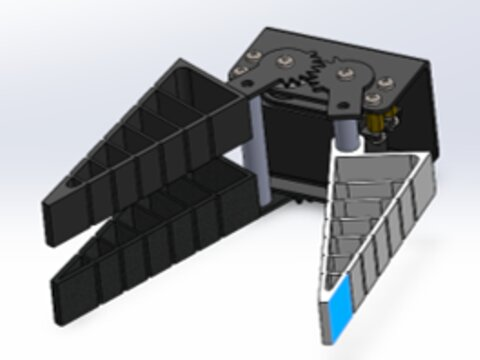 <b>Fin Ray Effect Adaptive Gripper</b> Compliant fingers, single servo with gear-synchronised motion, printed and tested on hardware</td>
<td align="center" valign="top">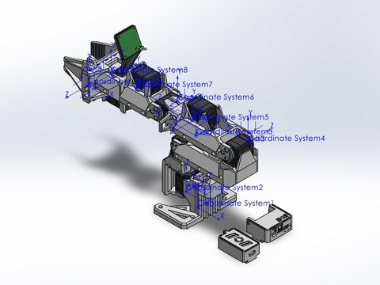 <b>SO-ARM 101 Modified: URDF Generation</b> SolidWorks remodel of the follower arm, link frames and joint limits, exported and validated URDF</td>
</tr>
<tr>
<td align="center" valign="top">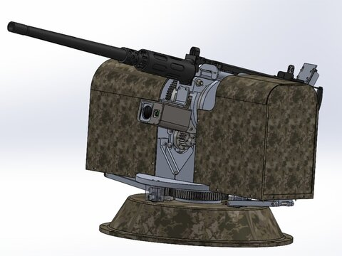 <b>Heavy Two-Axis Turret Mount</b> Slewing-bearing traverse with spur-gear reduction; BOM, fastener schedule, bearing spec and assembly animations</td>
<td align="center" valign="top">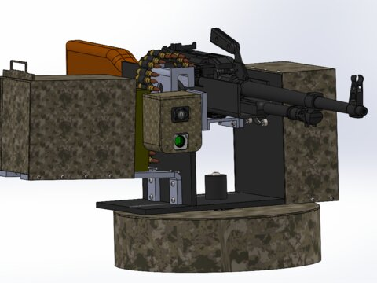 <b>Two-Axis Turret Mount: Manufacturing Package</b> NEMA 34 geared drive; 43 parts, 19 manufacturing drawings, 27 printable STL parts, screw BOM</td>
<td align="center" valign="top">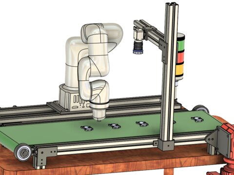 <b>Vision-Guided Pick-and-Place Cell</b> Cobot, belt conveyor and overhead camera mast on an aluminium-extrusion frame</td>
</tr>
</table>

## What each private project folder contains

| Folder | Content |
|---|---|
| `media/` | Renders, photos, full-length MP4 videos |
| `cad/` | STEP assembly and native SolidWorks parts and assemblies |
| `urdf/` | ROS description package: URDF, meshes, RViz and Gazebo launch files |
| `drawings/` | 2D manufacturing drawings (PDF + SLDDRW) |
| `stl/` | Print-ready STL files |
| `docs/` | BOMs, fastener schedules, specifications |

## Request access

To review the full CAD, URDF and drawing files for any project, contact me with your **GitHub username** and I will add you to the private repository.

- **Email:** [fhaq.msee23seecs@seecs.edu.pk](mailto:fhaq.msee23seecs@seecs.edu.pk)
- **LinkedIn:** [Fazal E Haq](http://www.linkedin.com/in/fazal-e-haq-84b2b821b/)
- **Fiverr:** [fiverr.com/fazalehaq_123](https://www.fiverr.com/fazalehaq_123)
